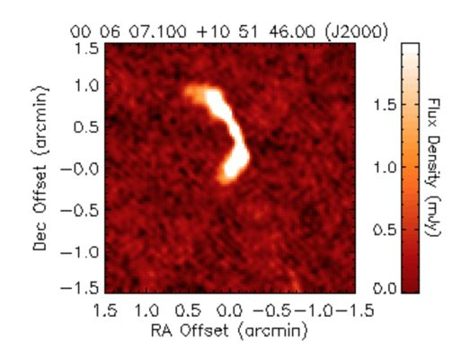
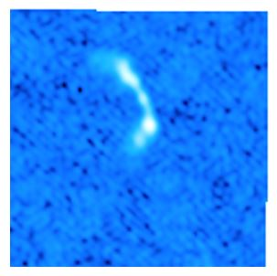
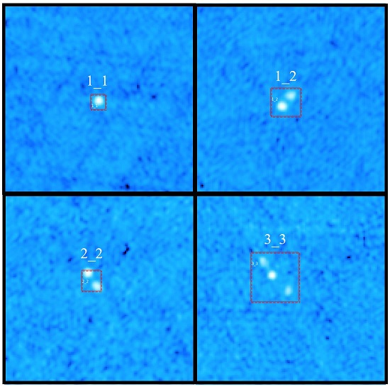
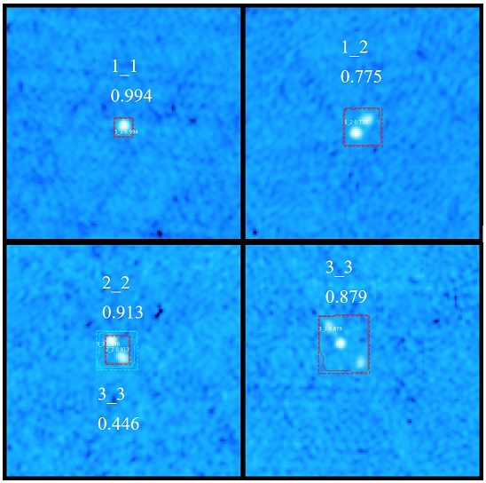

# Radio Galaxy Morphoogy Classification with Mask R-CNN 

This is an application of [Mask R-CNN](https://arxiv.org/abs/1703.06870) to Radio Galaxy Morphology Classification using data from [Radio Galaxy Zoo: ClaRAN - A Deep Learning Classifier for Radio Morphologies](https://github.com/chenwuperth/rgz_rcnn).

# Paper
Accepted to be presented at and published in the proceedings of [2020 2nd International Workshop on Signal Processing and Machine Learning (WSPML 2020)](http://www.wspml.org/), November 20-22, 2020

Draft of paper: [Radio Galaxy Morphology Classification with Mask R-CNN](https://www.dropbox.com/s/s0r2pjvq9bkk8d9/Radio%20Galaxy%20Morphology%20Classification%20Arslan.pdf?dl=0)

# Installation

* Clone repo
* Download and unzip images from [here](https://www.dropbox.com/s/jezo3jim08u8hmc/galaxy_data.tar_gz?dl=0)

# Dataset
The top image below is an original flux density image obtained from the open databased maintained by Space Telescope Science Institute (third.ucllnl.org) with linear scaling while the bottom image shows the derived image with log scaling as used in CLARAN and this paper.

# Results
Annotated Radio Galaxy images with bounding boxes used for training Mask R-CNN.

Upper left 1C_1P, upper right 1C_2P, lower left 2C_2P and lower right 3C_3P 

Classification results with Mask-RCNN for the above images.

# Author

Emin Alp Arslan [eminalparslan@gmail.com](eminalparslan@gmail.com)
